OpenClaw Architecture, Explained: How It Works
==============================================

In early January 2026, a small group of developers gathered at the first Claude Code Show & Tell event organized by Michael Galpert. We were twenty people, curious about agentic development and eager to share our experiences with the latest AI coding tools.

Just a few weeks later, on February 5th, Michael Galpert and Dave Morin organized the third event in the series, now rebranded as ClawCon, the 1st OpenClaw SF Show & Tell. Over 700 people showed up. The energy was electric. Investors like Ashton Kutcher spent nearly an hour having people pitch him projects. Peter Steinberger, the creator of OpenClaw, was the true Hollywood-like star of the night, with everyone surrounding him for questions, congratulations and selfies.

[

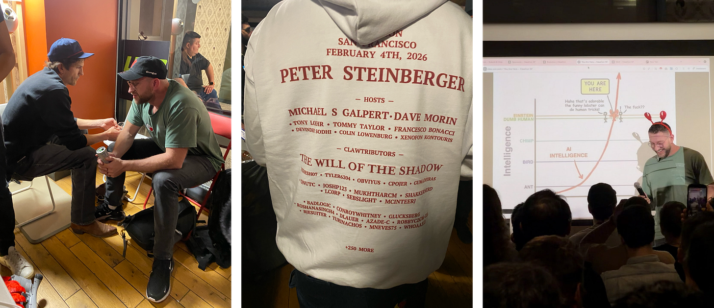

](https://substackcdn.com/image/fetch/$s_!XShL!,f_auto,q_auto:good,fl_progressive:steep/https%3A%2F%2Fsubstack-post-media.s3.amazonaws.com%2Fpublic%2Fimages%2F0d4d56a7-7b0a-4b61-9eb1-00da03daf0d7_2964x1280.png)

How did we get here? In just eight weeks, OpenClaw went from a weekend WhatsApp relay script to one of the fastest-growing open-source projects in GitHub history, surpassing 180,000 stars by early February. The growth wasn’t just viral; it was unprecedented.

[

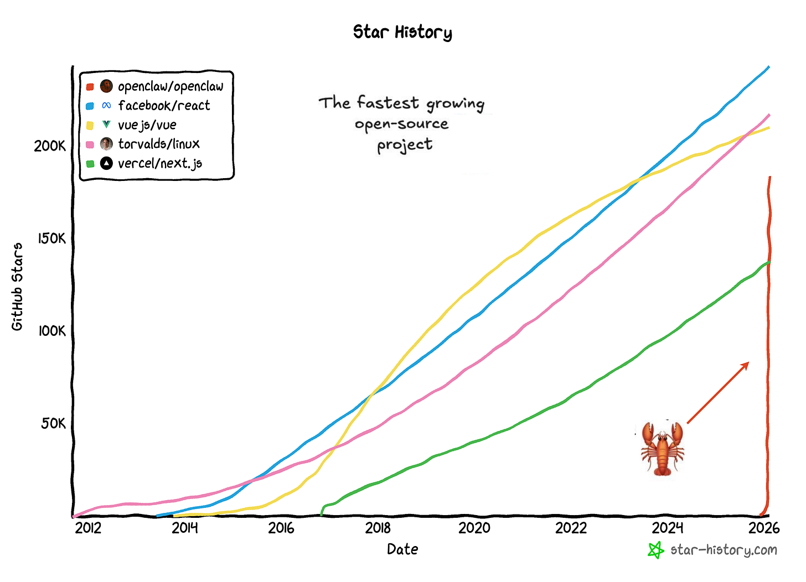

](https://substackcdn.com/image/fetch/$s_!2WmD!,f_auto,q_auto:good,fl_progressive:steep/https%3A%2F%2Fsubstack-post-media.s3.amazonaws.com%2Fpublic%2Fimages%2F821f4316-6fb0-43b3-bab0-8afc16147c0c_2990x2160.png)

The key, in my view, wasn’t just technical capability, it was productization. Peter built the scaffolding that turned agentic capabilities from a research work into something people could actually deploy and use to _really_ get things done.

OpenClaw turned “chatbots that respond” into “agents that act”, a persistent assistant running on your own hardware, accessible through messaging apps and interfaces you already use.

Andrej Karpathy called it “the most incredible sci-fi takeoff-adjacent thing I’ve seen.”

I’m generally curious about deeply learning and understanding the details of new AI frameworks or products - not just using them. OpenClaw seemed particularly relevant to my work building the first AI-native firm at [Axiom](https://axiompartners.vc/) and to helping our portfolio companies navigate agent architectures and product design strategies.

Being open source, I had the chance to deep dive into the code and put together this architectural breakdown of OpenClaw, offering practical guidance for founders navigating similar agent architectures.

[Introduction](https://ppaolo.substack.com/p/openclaw-system-architecture-overview#%C2%A7introduction)

[How OpenClaw Works: High-Level Overview](https://ppaolo.substack.com/i/187472685/how-openclaw-works-high-level-overview)

*   [Extensibility through Plugins](https://ppaolo.substack.com/p/openclaw-system-architecture-overview#%C2%A7extensibility-through-plugins)
    

[Core Components](https://ppaolo.substack.com/p/openclaw-system-architecture-overview#%C2%A7core-components)

*   [Channel Adapters](https://ppaolo.substack.com/p/openclaw-system-architecture-overview#%C2%A71-channel-adapters)
    
    *   [Authentication](https://ppaolo.substack.com/p/openclaw-system-architecture-overview#%C2%A7authentication)
        
    *   [Inbound message parsing](https://ppaolo.substack.com/p/openclaw-system-architecture-overview#%C2%A7inbound-message-parsing)
        
    *   [Access Control](https://ppaolo.substack.com/p/openclaw-system-architecture-overview#%C2%A7access-control)
        
    *   [Outbound message formatting](https://ppaolo.substack.com/p/openclaw-system-architecture-overview#%C2%A7outbound-message-formatting)
        
*   [Control Interfaces](https://ppaolo.substack.com/p/openclaw-system-architecture-overview#%C2%A72-control-interfaces)
    
    *   [Web UI](https://ppaolo.substack.com/p/openclaw-system-architecture-overview#%C2%A7web-ui)
        
    *   [CLI](https://ppaolo.substack.com/p/openclaw-system-architecture-overview#%C2%A7cli)
        
    *   [macOS app](https://ppaolo.substack.com/p/openclaw-system-architecture-overview#%C2%A7macos-app)
        
    *   [Mobile](https://ppaolo.substack.com/p/openclaw-system-architecture-overview#%C2%A7mobile)
        
*   [Gateway Control Plane](https://ppaolo.substack.com/p/openclaw-system-architecture-overview#%C2%A73-gateway-control-plane)
    
*   [Agent Runtime](https://ppaolo.substack.com/p/openclaw-system-architecture-overview#%C2%A74-agent-runtime)
    
    *   [Session Resolution](https://ppaolo.substack.com/p/openclaw-system-architecture-overview#%C2%A7session-resolution)
        
    *   [Context Assembly](https://ppaolo.substack.com/p/openclaw-system-architecture-overview#%C2%A7context-assembly)
        
    *   [Execution Loop](https://ppaolo.substack.com/p/openclaw-system-architecture-overview#%C2%A7execution-loop)
        
    *   [System Prompt Architecture](https://ppaolo.substack.com/p/openclaw-system-architecture-overview#%C2%A7system-prompt-architecture)
        

[Interaction and Coordination](https://ppaolo.substack.com/p/openclaw-system-architecture-overview#%C2%A7interaction-and-coordination)

*   [Canvas and Agent-to-UI (A2UI)](https://ppaolo.substack.com/p/openclaw-system-architecture-overview#%C2%A71-canvas-and-agent-to-ui-a2ui)
    
*   [Voice Wake and Talk Mode](https://ppaolo.substack.com/p/openclaw-system-architecture-overview#%C2%A72-voice-wake-and-talk-mode)
    
*   [Multi-Agent Routing](https://ppaolo.substack.com/p/openclaw-system-architecture-overview#%C2%A73-multi-agent-routing)
    
*   [Session Tools (Agent-to-Agent Communication)](https://ppaolo.substack.com/p/openclaw-system-architecture-overview#%C2%A74-session-tools-agent-to-agent-communication)
    
*   [Scheduled Actions (Cron Jobs) and External Triggers (Webhooks)](https://ppaolo.substack.com/p/openclaw-system-architecture-overview#%C2%A75-scheduled-actions-cron-jobs-and-external-triggers-webhooks)
    

[Deep Dive: End-to-End Message Flow](https://ppaolo.substack.com/p/openclaw-system-architecture-overview#%C2%A7deep-dive-end-to-end-message-flow)

*   [Phase 1: Ingestion](https://ppaolo.substack.com/p/openclaw-system-architecture-overview#%C2%A7phase-1-ingestion)
    
*   [Phase 2: Access Control & Routing](https://ppaolo.substack.com/p/openclaw-system-architecture-overview#%C2%A7phase-2-access-control-and-routing)
    
*   [Phase 3: Context Assembly](https://ppaolo.substack.com/p/openclaw-system-architecture-overview#%C2%A7phase-3-context-assembly)
    
*   [Phase 4: Model Invocation](https://ppaolo.substack.com/p/openclaw-system-architecture-overview#%C2%A7phase-4-model-invocation)
    
*   [Phase 5: Tool Execution](https://ppaolo.substack.com/p/openclaw-system-architecture-overview#%C2%A7phase-5-tool-execution)
    
*   [Phase 6: Response Delivery](https://ppaolo.substack.com/p/openclaw-system-architecture-overview#%C2%A7phase-6-response-delivery)
    

[Data Storage and State Management](https://ppaolo.substack.com/p/openclaw-system-architecture-overview#%C2%A7data-storage-and-state-management)

*   [Configuration](https://ppaolo.substack.com/p/openclaw-system-architecture-overview#%C2%A7configuration)
    
*   [Session State and Compaction](https://ppaolo.substack.com/p/openclaw-system-architecture-overview#%C2%A7session-state-and-compaction)
    
*   [Memory Search](https://ppaolo.substack.com/p/openclaw-system-architecture-overview#%C2%A7memory-search)
    
    *   [Storage and indexing](https://ppaolo.substack.com/p/openclaw-system-architecture-overview#%C2%A7storage-and-indexing)
        
    *   [Memory files in your workspace](https://ppaolo.substack.com/p/openclaw-system-architecture-overview#%C2%A7memory-files-in-your-workspace)
        
    *   [Embedding provider selection](https://ppaolo.substack.com/p/openclaw-system-architecture-overview#%C2%A7embedding-provider-selection)
        
    *   [Index Management](https://ppaolo.substack.com/p/openclaw-system-architecture-overview#%C2%A7index-management)
        
*   [Credentials](https://ppaolo.substack.com/p/openclaw-system-architecture-overview#%C2%A7credentials)
    

[Security Architecture](https://ppaolo.substack.com/p/openclaw-system-architecture-overview#%C2%A7security-architecture)

*   [Network Security](https://ppaolo.substack.com/p/openclaw-system-architecture-overview#%C2%A71-network-security)
    
*   [Authentication & Device Pairing](https://ppaolo.substack.com/p/openclaw-system-architecture-overview#%C2%A72-authentication-and-device-pairing)
    
*   [Channel Access Control](https://ppaolo.substack.com/p/openclaw-system-architecture-overview#%C2%A73-channel-access-control)
    
*   [Tool Sandboxing](https://ppaolo.substack.com/p/openclaw-system-architecture-overview#%C2%A74-tool-sandboxing)
    
    *   [Session-based security boundaries](https://ppaolo.substack.com/p/openclaw-system-architecture-overview#%C2%A7session-based-security-boundaries)
        
    *   [What changes the security profile](https://ppaolo.substack.com/p/openclaw-system-architecture-overview#%C2%A7what-changes-the-security-profile)
        
    *   [Tool policy and precedence](https://ppaolo.substack.com/p/openclaw-system-architecture-overview#%C2%A7tool-policy-and-precedence)
        
*   [Prompt Injection Defense](https://ppaolo.substack.com/p/openclaw-system-architecture-overview#%C2%A75-prompt-injection-defense)
    

[Deployment Architectures](https://ppaolo.substack.com/p/openclaw-system-architecture-overview#%C2%A7deployment-architectures)

*   [Local Development (macOS/Linux)](https://ppaolo.substack.com/p/openclaw-system-architecture-overview#%C2%A7local-development-macoslinux)
    
*   [Production macOS (Menu Bar App)](https://ppaolo.substack.com/p/openclaw-system-architecture-overview#%C2%A7production-macos-menu-bar-app)
    
*   [Linux/VM (Remote Gateway)](https://ppaolo.substack.com/p/openclaw-system-architecture-overview#%C2%A7linuxvm-remote-gateway)
    
    *   [Option A: SSH Tunnel (recommended default)](https://ppaolo.substack.com/p/openclaw-system-architecture-overview#%C2%A7option-a-ssh-tunnel-recommended-default)
        
    *   [Option B: Tailscale Serve (tailnet-only HTTPS)](https://ppaolo.substack.com/p/openclaw-system-architecture-overview#%C2%A7option-b-tailscale-serve-tailnet-only-https)
        
*   [Fly.io (Container Deployment)](https://ppaolo.substack.com/p/openclaw-system-architecture-overview#%C2%A7flyio-container-deployment)
    

[Conclusion](https://ppaolo.substack.com/p/openclaw-system-architecture-overview#%C2%A7conclusion)

OpenClaw is a personal AI assistant platform that runs on your own infrastructure: your laptop, a VPS, a Mac Mini in your closet, or a cloud container. It connects AI models and tools to the messaging apps you already use: WhatsApp, Telegram, Discord, Slack, Signal, iMessage, Microsoft Teams, and many others.

OpenClaw treats your AI assistant as an infrastructure problem, not just a prompt engineering problem. Instead of trying to make an LLM “remember” context or behave safely through clever prompts, OpenClaw builds a structured execution environment around the model, with proper session management, memory systems, tool sandboxing, and message routing. The LLM provides intelligence; OpenClaw provides the operating system.

You control where the assistant runs, how it routes messages, which tools it can use, and how sessions are isolated. Model API calls still go to Anthropic, OpenAI, or wherever your models live; but the conversation history, tool execution, session state, and all the orchestration logic stays on your infrastructure.

OpenClaw targets developers and power users who want a personal AI assistant accessible from any messaging app, without handing the entire experience to a hosted third-party assistant. If you’ve ever wanted Claude or GPT available in your WhatsApp DMs, your Slack channels, and your iMessage threads, all while keeping the intelligence running on your own hardware, OpenClaw delivers that experience.

OpenClaw is not a chatbot wrapper around an API for AI models. It’s an operating system for AI agents. OpenClaw treats AI as an infrastructure problem: sessions, memory, tool sandboxing, access control, and orchestration.

The AI model provides the intelligence; OpenClaw provides the execution environment.

OpenClaw follows a hub-and-spoke architecture centered on a single Gateway that acts as the control plane between user inputs (WhatsApp, iMessage, Slack, macOS app, web UI, CLI) and the AI agent:

*   The Gateway is a WebSocket server that connects to messaging platforms and control interfaces, dispatching each routed message to the Agent Runtime.
    
*   The Agent Runtime runs the AI loop end-to-end, assembling context from session history and memory, invoking the model, executing tool calls against the system’s available capabilities (browser automation, file operations, Canvas, scheduled jobs, and more), and persisting the updated state.
    

The key insight is that OpenClaw separates the interface layer (where messages come from) from the assistant runtime (where intelligence and execution live). This means you get one persistent assistant accessible through any messaging app you already use, with conversation state and tool access managed centrally on your hardware.

The following diagram provides a high-level view of the system architecture (click to enlarge):

OpenClaw is designed to be extended without modifying core code. Plugins extend the system in four main ways:

*   **Channel plugins**: Additional messaging platforms (Microsoft Teams, Matrix, Mattermost, etc.)
    
*   **Memory plugins**: Alternative storage backends (vector stores, knowledge graphs vs. default SQLite)
    
*   **Tool plugins**: Custom capabilities beyond built-in bash, browser, and file operations
    
*   **Provider plugins**: Custom LLM providers or self-hosted models
    

The plugin system lives in `extensions/` and follows a discovery-based model. The plugin loader in `src/plugins/loader.ts` scans workspace packages for an `openclaw.extensions` field in their `package.json`, validates against declared schemas, and hot-loads when configuration is present.

Each messaging platform gets its own dedicated adapter. Some adapters ship built-in (you’ll find them in directories like `src/telegram/`, `src/discord/`, `src/slack/`, `src/imessage/`, and so on), and others can be added via channel plugins. Adapters implement the same interface and normalize inbound/outbound messaging so the rest of OpenClaw doesn’t need to care about platform-specific quirks. While the platforms differ wildly in their APIs and protocols, every adapter implements a common interface with four key responsibilities:

1.  Authentication
    
2.  Inbound message parsing
    
3.  Access Control
    
4.  Outbound message formatting
    

Authentication varies by platform. WhatsApp uses QR code pairing through the Baileys library, storing credentials in `~/.openclaw/credentials`. Telegram and Discord use bot tokens provided through environment variables like `TELEGRAM_BOT_TOKEN` and `DISCORD_BOT_TOKEN`. iMessage requires native macOS integration and needs a properly signed Messages app.

Inbound message parsing handles the messy reality of different platforms’ data formats. Each adapter extracts text, handles media attachments (images, audio, video, documents), processes reactions and emojis, and maintains thread or reply context. This normalization layer means the rest of OpenClaw doesn’t need to know whether a message came from WhatsApp or Discord.

Access control is where security happens at the channel level. Allowlists specify which phone numbers or usernames can interact with your bot; for example, `channels.whatsapp.allowFrom` accepts an array of phone numbers. DM policies control how the bot handles direct messages from unknown senders. The default `"pairing"` policy requires approval before processing messages. You can set it to `"open"` to accept all DMs (not recommended) or `"disabled"` to reject them entirely. Group policies add another layer, including mention requirements and group-specific allowlists.

Each platform has its own markdown dialect, message size limits, and media upload APIs. The adapter handles all of this, including chunking long messages to respect platform limits, rendering markdown appropriately, uploading media files, and even managing typing indicators and presence information.

Here’s what a WhatsApp configuration might look like:

    {
      "channels": {
        "whatsapp": {
          "enabled": true,
          "allowFrom": ["+1234567890"],
          "groups": {
            "*": { "requireMention": true }
          }
        }
      }
    }

OpenClaw provides multiple ways to interact with the Gateway, each suited to different use cases and preferences:

1.  Web UI
    
2.  CLI
    
3.  macOS app
    
4.  Mobile
    

The Web UI is built with Lit-based web components and served directly from the Gateway itself. Point your browser at `http://127.0.0.1:18789/` by default, and you get a dashboard for chat, configuration management, session inspection, node management, and health monitoring. No separate web server needed: the Gateway handles it all.

The CLI, implemented through Commander.js starting from `openclaw.mjs` and flowing through `src/cli/program.ts`, gives you command-line control over everything. Start the Gateway with `openclaw gateway`. Invoke the agent directly with `openclaw agent`. Pair WhatsApp or Signal using `openclaw channels login`. Send messages programmatically via `openclaw message send`. Run health diagnostics with `openclaw doctor`. Or walk through the guided setup with `openclaw onboard`.

The macOS app takes a different approach. Written in Swift and living in `apps/macos/`, it sits in your menu bar providing Gateway lifecycle management - start, stop, restart at your fingertips. It includes Voice Wake functionality with a push-to-talk overlay, embeds WebChat in a native browser view, and can even control remote gateways over SSH.

Mobile nodes for iOS and Android connect to the Gateway as WebSocket nodes by declaring `role: "node"` in their connection handshake. This isn’t just for chat; these apps expose device-specific capabilities like camera access, screen recording, location services, and Canvas rendering. The Gateway can invoke these capabilities using the `node.invoke` protocol method, turning your phone into an extension of the agent’s toolset.

The Gateway lives in `src/gateway/server.ts` and runs on Node.js 22 or newer. It’s built using the `ws` WebSocket library and by default binds to `127.0.0.1:18789`, loopback-only for security. This isn’t just a router; it’s the single source of truth for the entire OpenClaw system.

Every messaging platform (WhatsApp via the Baileys library, Telegram through grammY, Discord using discord.js) connects through this central point. CLI tools, the web UI, and mobile apps all connect as WebSocket clients. When an inbound message arrives, the Gateway routes it through access control checks, resolves which session should handle it, and dispatches it to the appropriate agent. It coordinates system state including sessions, presence indicators, health monitoring, and cron jobs. And crucially, it enforces security through token or password authentication for any non-loopback bindings and implements a pairing system for direct messages.

The design principles here are deliberate. First, there’s exactly one Gateway per host: this prevents WhatsApp session conflicts since WhatsApp’s protocol is strictly single-device. Second, the entire protocol is typed: all WebSocket frames are validated against JSON Schema, which itself is generated from TypeBox definitions. This means if your client sends malformed data, it’s caught immediately. Third, the system is event-driven rather than poll-based. Clients subscribe to events like `agent`, `presence`, `health`, and `tick` instead of constantly asking “what’s new?” Finally, any side-effecting operation requires an idempotency key, making retry logic safe and preventing duplicate actions. Local connections (loopback or same tailnet) can be auto-approved, while remote connections require challenge-response signing and explicit approval.

The Agent Runtime, implemented in `src/agents/piembeddedrunner.ts`, is where AI interactions actually happen. It uses the Pi Agent Core library (`@mariozechner/pi-agent-core`) and follows an RPC-style invocation model with streaming responses.

At a high level, the runtime does four things every turn: (1) resolve the session, (2) assemble context, (3) stream the model response while executing tool calls, and (4) persist updated state back to disk.

When a message arrives, the runtime first figures out which session should handle it. A direct message from you maps to the `main` session. A DM coming through a channel maps to `dm:<channel>:<id>`. A group chat maps to `group:<channel>:<id>`. Sessions are not just IDs - they’re security boundaries. Each session type can carry different permissions and sandboxing rules (for example: `main` can run tools on the host, while `dm`/`group` sessions can default to a tighter allowlist and Docker isolation).

Once the session is resolved, the runtime assembles context for the model. It typically:

*   Loads session history from persisted JSON session files (so each session maintains continuity over time).
    
*   Builds a dynamic system prompt by reading workspace configuration files and composing them into a single instruction stack.
    
*   Pulls in memory via semantic search (e.g., prior relevant turns or notes) so the model sees only the most relevant historical context instead of an ever-growing transcript.
    

This assembled context is then streamed to the configured model provider (Anthropic Claude, OpenAI GPT, Google Gemini, or even local models) so you get responses token-by-token instead of waiting for a single final blob.

As the model responds, the runtime watches for tool calls and intercepts them. If the model requests a tool (e.g., run a bash command, read/write a file, open a browser and scrape a webpage), the runtime executes that tool, potentially inside a Docker sandbox depending on the session’s sandbox policy. Each tool result gets streamed back into the ongoing model generation, which incorporates it and continues. After the conversation turn completes, the runtime persists the updated session state (messages, tool calls/results, and any other tracked state) back to disk.

OpenClaw builds prompts by composing multiple sources:

**Workspace configuration files**:

*   `AGENTS.md` — Core agent instructions (bundled default). The operational baseline: what the agent is allowed to do, global constraints, and non-negotiable rules that apply across all sessions.
    
*   `SOUL.md` — Personality and tone guidance (optional). Voice and interaction style: how the agent speaks and structures answers, but not tool behavior or security boundaries.
    
*   `TOOLS.md` — User-specific tool conventions (optional). Your personal notes about how tools should be used in your environment, not a tool registry. OpenClaw automatically provides tool definitions to the model.
    

**Dynamic context** (assembled per turn):

*   Session history — Recent messages from the current conversation
    
*   Skills (`skills/<skill>/SKILL.md`) — Skill definition and usage instructions (required for a skill to exist).files containing structured guides for accomplishing specific tasks using available tools, think playbooks or standard operating procedures.
    
*   Memory search — Semantically similar past conversations that provide useful context
    

**Tool definitions** (auto-generated):

*   Built-in tools (`src/agents/pi-tools.ts`, `src/agents/openclaw-tools.ts`) — bash, browser, file operations, canvas, and core capabilities
    
*   Plugin tools (registered via `api.registerTool(toolName, toolDefinition)`) — Custom tools added via the extension system
    

**Base system**:

*   Pi Agent Core — Base instructions from the agent runtime library
    

All these elements combine into the final system prompt, which is sent to the model along with conversation history and the current user message. This composable approach means you can change agent behavior, style, and task competence by editing files in the workspace, without touching source code, while keeping execution, permissions, and sandboxing enforced by the runtime.

Skill discovery vs. skill injection is an important detail: OpenClaw can discover skills at runtime, but does not blindly inject every skill into every prompt. Instead, the runtime selectively injects only the skill(s) relevant to the current turn to avoid ballooning the prompt and degrading model performance.

Canvas is an agent-driven visual workspace that runs as a separate server process, defaulting to port 18793. This separation from the main Gateway provides isolation (if Canvas crashes, the Gateway continues operating normally) and establishes a different security boundary since Canvas serves agent-writable content.

The flow works like this: the agent calls a canvas update method, the Canvas server receives the HTML and parses any A2UI attributes embedded in it, the server pushes this content over WebSocket to connected browser clients, and the client renders the HTML as an interactive interface.

[

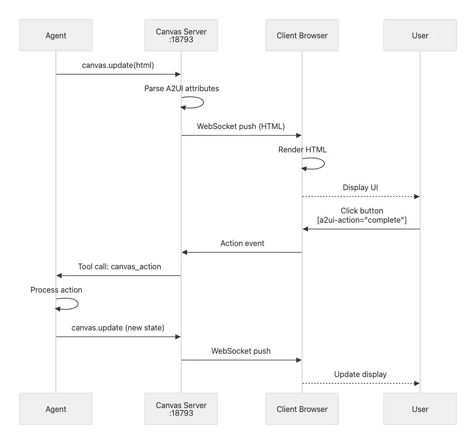

](https://substackcdn.com/image/fetch/$s_!uZOJ!,f_auto,q_auto:good,fl_progressive:steep/https%3A%2F%2Fsubstack-post-media.s3.amazonaws.com%2Fpublic%2Fimages%2F99d80f71-7a18-4854-9617-58e142334f6f_980x915.png)

A2UI stands for Agent-to-UI and provides a declarative framework where agents generate HTML with special attributes. These attributes create interactive elements without requiring the agent to write JavaScript. For example:

    

      <button a2ui-action="complete" a2ui-param-id="123">
        Mark Complete
      </button>
    

When a user clicks that button, the client sends an action event to the Canvas server, which forwards it as a tool call to the agent. The agent processes the action, perhaps marking task 123 as complete in its internal state, and calls canvas update with the new state. The server pushes this update to the client, and the display refreshes automatically.

Canvas support extends across multiple platforms. The macOS app uses a native WebKit view for rendering. The iOS app wraps Canvas in a Swift UI component. Android uses WebView for display. And of course, the web UI can simply open Canvas in a browser tab.

Voice Wake is available on macOS, iOS, and Android, providing always-on wake word detection. Say “Hey OpenClaw” and the system activates, ready for your command. Alternatively, use push-to-talk with a keyboard shortcut. Audio streams to ElevenLabs for transcription, the agent processes your request, and the response plays back through ElevenLabs text-to-speech.

Talk Mode extends this into continuous conversation. You can have a hands-free back-and-forth dialogue with the agent, with interruption detection so you can break in when the agent is speaking. Configure custom wake phrases to suit your preferences.

Multi-agent routing lets you direct different channels or groups to completely isolated agent instances. Each instance can have its own workspace, its own model, and its own behavior.

[

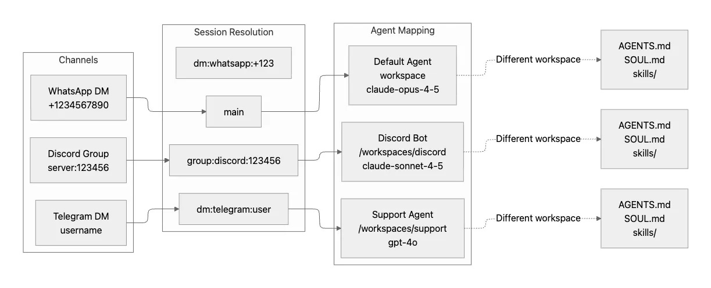

](https://substackcdn.com/image/fetch/$s_!MK0a!,f_auto,q_auto:good,fl_progressive:steep/https%3A%2F%2Fsubstack-post-media.s3.amazonaws.com%2Fpublic%2Fimages%2Fff9c8af5-2816-479d-9bf7-b7004909bd99_1223x497.png)

Imagine you want your Discord server bot to have a helpful moderator personality using Claude Sonnet, while your Telegram support DMs should use GPT-4 with access to different tools and a more formal tone. The configuration expresses this naturally:

    {
      "agents": {
        "mapping": {
          "group:discord:123456": {
            "workspace": "~/.openclaw/workspaces/discord-bot",
            "model": "anthropic/claude-sonnet-4-5",
            "systemPromptOverrides": {
              "SOUL.md": "You are a helpful Discord moderator..."
            }
          },
          "dm:telegram:*": {
            "workspace": "~/.openclaw/workspaces/support-agent",
            "model": "openai/gpt-4o",
            "sandbox": { "mode": "always" }
          }
        }
      }
    }

This routing enables several powerful use cases. You can create separate personas per community, each optimized for that community’s culture and needs. Different contexts can have different tool access: maybe your Discord bot can use browser automation, but your support agent can’t. Isolated sandboxes for untrusted users ensure that even if someone tries to exploit a prompt injection vulnerability, the blast radius stays contained. And you can test new agent behaviors in one context without affecting established, working agents in other contexts.

Session tools enable agents to coordinate across different sessions, essentially providing inter-agent communication. These tools are particularly useful when you want agents to collaborate on complex tasks or share information without requiring you to manually copy-paste between different chat contexts.

*   The `sessions_list` tool discovers active sessions. This lets an agent see what other agents are available.
    
*   The `sessions_send` tool messages another session. For example, you might set `announceStep: "ANNOUNCE_SKIP"` to have one agent silently send work to another without notifying the user in either session.
    
*   The `sessions_history` tool fetches transcripts from other sessions, useful when one agent needs context from another agent’s interactions to make informed decisions.
    
*   The `sessions_spawn` tool creates new sessions programmatically for delegating work.
    

Cron jobs let you schedule agent actions to run at specific times. Want a daily summary? Configure a cron job that triggers at 9 AM every day, sending a message to your main session. Webhooks provide external trigger points for agent actions. The classic example is email integration where Gmail publishes to a webhook endpoint that triggers agent actions.

Both features use configuration-based setup, allowing you to automate recurring tasks and integrate with external systems without writing custom code.

Let’s trace what happens when you send a WhatsApp message to your OpenClaw assistant. Understanding this flow reveals how all the components work together.

First, the Baileys library receives a WebSocket event from WhatsApp’s servers. The WhatsApp adapter in `src/whatsapp/` parses this event, extracting the message text, any media attachments, and metadata about the sender.

Before the message goes any further, it hits the access control layer. Is this sender in your allowlist? If it’s a first-time DM, has pairing been approved? If either check fails, the message stops here.

Assuming access control passes, the auto-reply system in `src/auto-reply/reply.ts` takes over. It resolves which session should handle this message. If it’s directly from you, that’s the `main` session with full capabilities. A DM through WhatsApp becomes `agent:main:whatsapp:dm:+123...`. A group chat becomes `agent:main:whatsapp:group:120...@g.us`. Each session type carries different permissions and sandboxing rules.

The Agent Runtime’s `PiEmbeddedRunner` loads the resolved session from disk. It assembles the system prompt by reading `AGENTS.md`, `SOUL.md`, and `TOOLS.md` from your workspace, injecting relevant skills, and querying the memory search system for semantically similar past conversations that might provide useful context.

This rich context gets packaged up and streamed to your configured model provider.

As the model responds, the runtime watches for tool calls. If the model decides it needs to run a bash command, the runtime intercepts that call and executes it, potentially inside a Docker sandbox if this is a non-main session. If the model wants to open a browser and scrape a website, the runtime fires up Chromium with Chrome DevTools Protocol automation. Each tool result gets streamed back to the model , which incorporates it into its ongoing response.

Response chunks flow back through the Gateway as they arrive. The WhatsApp adapter formats each chunk, converting markdown to WhatsApp’s markup format and respecting message size limits. The formatted messages go out through Baileys to WhatsApp’s servers and eventually to your phone. Finally, the runtime persists the entire conversation state (your message, the model’s response, all tool calls and results) back to the session JSON file on disk.

The latency budget for this entire flow looks roughly like this: access control takes under 10 milliseconds. Loading the session from disk takes under 50 milliseconds. Assembling the system prompt takes under 100 milliseconds. Getting the first token back from the model takes 200 to 500 milliseconds depending on network conditions. Tool execution varies: bash commands typically complete in under 100 milliseconds, while browser automation might take 1 to 3 seconds.

[

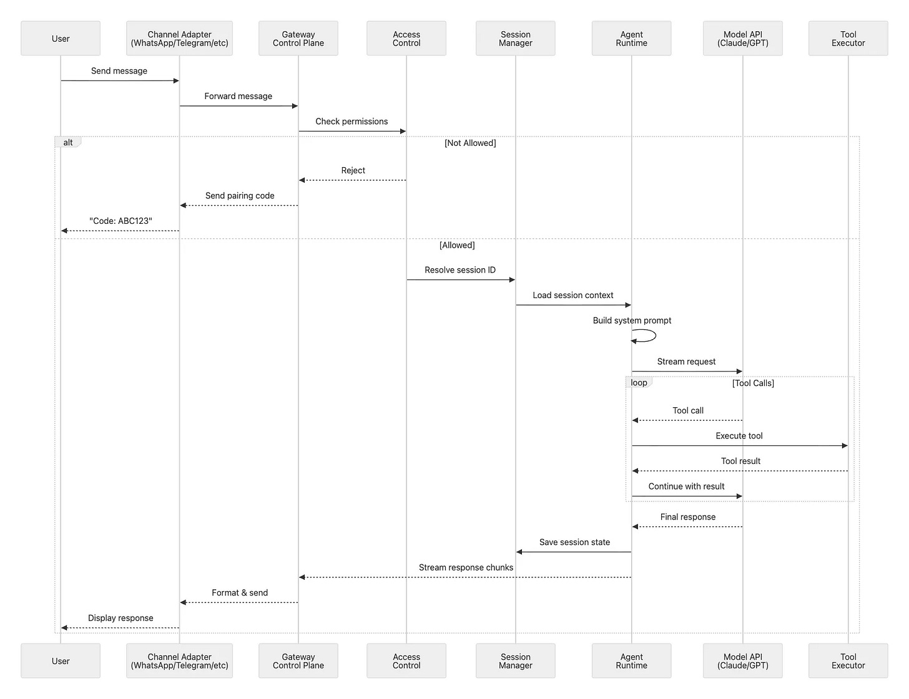

](https://substackcdn.com/image/fetch/$s_!qxRY!,f_auto,q_auto:good,fl_progressive:steep/https%3A%2F%2Fsubstack-post-media.s3.amazonaws.com%2Fpublic%2Fimages%2Fdc2a349c-91c9-402f-8356-16dbb2583952_1724x1327.png)

OpenClaw stores its data and configuration across several locations in your home directory. Understanding this layout helps with backups, migrations, and troubleshooting.

[

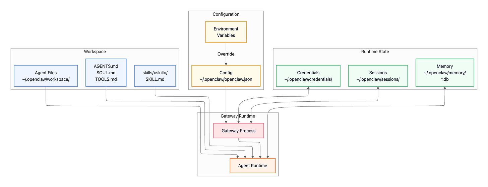

](https://substackcdn.com/image/fetch/$s_!EfuY!,f_auto,q_auto:good,fl_progressive:steep/https%3A%2F%2Fsubstack-post-media.s3.amazonaws.com%2Fpublic%2Fimages%2Fd3387882-3f4d-4d40-9ad3-f09ae4802852_1798x690.png)

The main configuration file lives at `~/.openclaw/openclaw.json` and uses JSON5 format, which means you can include comments and trailing commas—features that make hand-editing much more pleasant than strict JSON. Configuration is layered: environment variables override config file values, which in turn override built-in defaults. This lets you keep sensitive tokens in environment variables while maintaining static configuration in the file.

OpenClaw persists each conversation as a session file under `~/.openclaw/sessions/`, capturing the conversation history for that session along with metadata and any persistent tool state.

Sessions are stored as an append-only event log with support for branching, which makes it easy to recover state, inspect history, and reason about where a given turn belongs in a conversation tree.

To stay within model context limits, OpenClaw performs automatic compaction: older parts of the conversation are summarized and persisted so the session can continue without losing essential context. Before compaction, the system can run a lightweight “memory flush” step that promotes durable information into memory files; this helps prevent important details from being lost when older turns are condensed, and it is skipped when the session workspace is not writable.

Session identifiers encode both ownership and trust boundary. The main operator session is keyed as `agent:<agentId>:main` and runs with full capabilities. DM sessions use `agent:<agentId>:<channel>:dm:<identifier>` and group sessions use `agent:<agentId>:<channel>:group:<identifier>`; both are sandboxed by default to protect the host from untrusted inputs and multi-participant conversations.

OpenClaw maintains a searchable memory of your conversations to provide relevant context when you interact with the agent. When you ask a question, the system automatically searches past conversations for semantically similar discussions and injects that context into the current turn, so the agent can reference things you talked about weeks ago without you having to repeat yourself.

The memory system stores data in `~/.openclaw/memory/<agentId>.sqlite` using SQLite databases with vector embeddings. As messages arrive, they’re automatically indexed. The system uses hybrid search combining vector similarity (semantic matching) with BM25 keyword relevance (exact token matching) to find the most relevant past context.

Beyond conversation transcripts, you can maintain structured memory files that the agent can reference:

*   `MEMORY.md` — Long-term memory containing curated, stable facts. This file is loaded only in private/main sessions for privacy, never in group chats where others might see your personal context.
    
*   `memory/YYYY-MM-DD.md` — Daily notes providing a raw running log of activities and context for each day.
    

The memory system needs an embedding model to convert text into searchable vectors. OpenClaw automatically selects a provider based on what you have configured:

1.  If you’ve configured a local embedding model (`local.modelPath`), use that
    
2.  Otherwise, check for an OpenAI API key and use OpenAI embeddings
    
3.  Otherwise, check for a Gemini API key and use Gemini embeddings
    
4.  If none are available, memory search is disabled
    

The file watcher monitors your memory files and automatically reindexes them when they change (with a 1.5-second debounce to avoid thrashing). If you change your embedding provider or model, the system detects this and automatically reindexes everything. You can also enable experimental session transcript indexing with `experimental.sessionMemory: true`, which makes the full conversation history searchable rather than just memory files. Finally, if sqlite-vec is available, it accelerates vector search operations inside SQLite.

Sensitive authentication data goes in `~/.openclaw/credentials/`. This includes channel authentication tokens like WhatsApp’s session data, OAuth credentials for platforms like Discord, and any other secrets needed for channel access. File permissions are restricted to 0600 (owner read/write only), and the directory is automatically excluded from version control to prevent accidental leaks.

OpenClaw implements defense in depth through multiple security layers. Each layer provides a different type of protection, and they work together to create a comprehensive security posture.

By default, the Gateway binds exclusively to `127.0.0.1`, your loopback interface. This means the Gateway is only accessible from the local machine, never exposed to the public internet. Remote access requires explicit configuration through one of several supported methods:

    # SSH tunnel (recommended for VPS)
    ssh -N -L 18789:127.0.0.1:18789 user@host
    

Tailscale integration offers two modes. Tailscale Serve provides tailnet-only HTTPS access, your Gateway becomes available to other devices on your Tailscale network through a secure, encrypted connection. Tailscale Funnel goes further, exposing your Gateway to the public internet through Tailscale’s infrastructure.

    # Tailscale Serve (tailnet-only HTTPS)
    config: gateway.tailscale.mode: "serve"
    
    # Tailscale Funnel (public HTTPS, requires password)
    config: gateway.tailscale.mode: "funnel"
           gateway.auth.mode: "password"
    

The same WebSocket handshake and authentication mechanisms work regardless of whether you’re connecting over SSH, Tailscale, or a direct connection.

**Token-based or password authentication** protects non-loopback bindings. Set the `OPENCLAW_GATEWAY_TOKEN` environment variable before starting the Gateway, and all WebSocket clients must include that token in their `connect.params.auth.token` field. Alternatively, configure password authentication through `gateway.auth.mode: "password"` in your config file (required for Tailscale Funnel).

**Device-based pairing** adds an additional security layer. All WebSocket clients (Control UI, nodes, CLI tools) include a **device identity** during the `connect` handshake. Device identities consist of a device ID and cryptographic keys. When a new device connects:

*   **Local connections** (loopback or same Tailscale network) can be configured for auto-approval to streamline same-host workflows
    
*   **Remote connections** must sign a challenge nonce during the handshake to prove they possess valid credentials, and require explicit approval
    

Once approved, the Gateway issues a **device token** for that device, allowing subsequent connections without re-approval. This device-based model prevents unauthorized access even if someone obtains your authentication token.

**Important**: The Control UI requires a secure context (HTTPS or localhost) to generate device identity using `crypto.subtle`. If you enable `gateway.controlUi.allowInsecureAuth`, the UI falls back to token-only auth over plain HTTP and skips device pairing—this is a security downgrade. Prefer HTTPS (Tailscale Serve) or access the UI on `127.0.0.1`.

**DM pairing** provides human-in-the-loop approval for direct messages. When `dmPolicy="pairing"` (the default), unknown senders trigger a specific flow: they send their first message, and the Gateway responds with a unique pairing code instead of processing the message. You approve the sender by running `openclaw pairing approve <channel> <code>`, which adds them to a local allowlist store. Only then will their messages reach the agent.

**Allowlists** explicitly specify which phone numbers or usernames can interact with your bot. For WhatsApp: `channels.whatsapp.allowFrom: ["+1234567890"]`. For Telegram: `channels.telegram.allowFrom` with usernames or numeric IDs.

**Group policies** add another layer of control:

*   `requireMention`: Bot only responds when @mentioned in groups
    
*   Group-specific allowlists: `channels.whatsapp.groups` becomes a group allowlist when set (include `"*"` to allow all groups)
    
*   Per-channel mention patterns: `messages.groupChat.mentionPatterns: ["@openclaw"]`
    

OpenClaw uses Docker-based sandboxing to isolate tool execution on a per-session basis. The `main` session (your direct interaction as the operator) typically runs tools natively on the host with full access. In contrast, DM and group sessions can be configured to execute tools inside ephemeral Docker containers, reducing the impact of untrusted inputs.

Each sandbox container provides an isolated filesystem, optional network access (often disabled by default and explicitly enabled only when needed), and configurable resource limits (CPU/memory). Containers are short-lived: they are created for sandboxed execution and then destroyed, so even if a DM or group session is coerced into unsafe behavior, the “blast radius” is constrained to that container rather than your host environment.

This model maps cleanly onto session trust levels:

*   **Main session:** full host access for operator workflows (no Docker overhead).
    
*   **DM sessions:** sandboxed by default (even for approved contacts) to contain mistakes or prompt injection.
    
*   **Group sessions:** sandboxed by default to defend against higher-risk, multi-participant inputs.
    

A few high-level knobs determine how strong the isolation is:

*   **What is sandboxed:** sandboxing applies to _tools_ (e.g., shell/process/file operations, and optionally browser automation), not to the Gateway itself.
    
*   **Container granularity:** isolation can be per session (strongest), per agent, or shared across sandboxed sessions (most efficient, least isolated).
    
*   **Host exposure:** workspaces and bind mounts determine whether the container sees nothing from the host, a read-only view, or read/write access. Bind mounts are powerful but can reintroduce risk if they expose sensitive paths.
    
*   **Network access:** enabling container networking expands capability but also increases risk; keep it constrained unless the session truly needs it.
    
*   **Escape hatches:** any explicitly “host-level” or elevated tools that bypass the sandbox should be treated as high-trust-only surfaces.
    

Tool access is governed by layered policy, and effective permissions narrow as you move from operator to untrusted contexts.

Tool policy precedence (later sources override earlier):

> Tool Profile → Provider Profile → Global Policy → Provider Policy → Agent Policy → Group Policy → Sandbox Policy

Group and sandbox policies can further restrict the tool set available to an agent, but they should not be used to expand access beyond what earlier policies allow.

Context isolation helps defend against prompt injection attacks by keeping inputs clearly separated. User messages carry source metadata, system instructions remain distinct from user-provided content, and tool results are wrapped in structured formats that differentiate them from user input. This separation makes it harder for an attacker to trick the agent into treating an untrusted message as a system instruction.

Model selection also plays a role. OpenClaw’s documentation recommends using best-tier, latest-generation models for any bot that can run tools or touch files/networks (and explicitly suggests Claude Opus 4.5 as a strong default). If smaller models are used for cost or latency reasons, the docs recommend compensating by reducing blast radius: prefer read-only tools, minimize filesystem exposure, apply strict sandboxing, and enforce tight allowlists.

These protections only hold when backed by hard controls. Keep inbound DMs locked down via pairing/allowlists, prefer mention gating in groups rather than running “always-on” in public rooms, treat links/attachments/pasted instructions as hostile by default, and run sensitive tool execution in sandboxes while keeping secrets out of the agent’s reachable filesystem. For untrusted channels, enable sandboxing broadly and disable network-capable tools (`web_search`/`web_fetch`/`browser`) unless inputs are tightly controlled. Sandboxing is opt-in, and system prompt guardrails are soft guidance; enforcement comes from channel access controls, tool policy restrictions, sandbox containment, and (when applicable) explicit execution approvals.

OpenClaw supports four primary deployment patterns, each optimized for different use cases and environments. The architecture remains consistent across all patterns; what changes is where the Gateway runs and how clients connect to it.

In a local development setup, everything runs on your developer machine. You start the Gateway in the foreground with `pnpm dev`, which enables hot reload on code changes. The Gateway binds to `127.0.0.1:18789`, accessible only from the local machine. CLI tools and the web UI connect directly to this loopback address. There’s no authentication required since the loopback interface is considered trusted, and debug logging runs at full verbosity.

This pattern is represented visually as:

[

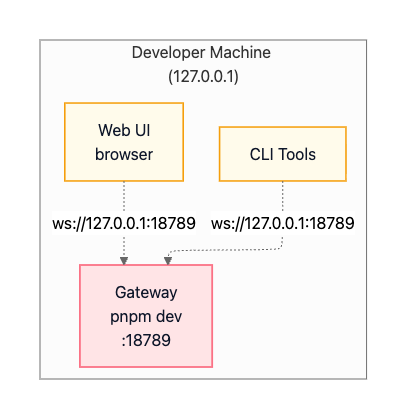

](https://substackcdn.com/image/fetch/$s_!ofiD!,f_auto,q_auto:good,fl_progressive:steep/https%3A%2F%2Fsubstack-post-media.s3.amazonaws.com%2Fpublic%2Fimages%2Fb852cd4a-873d-438e-9c7a-f7eec298c44b_407x419.png)

The macOS production deployment uses a LaunchAgent to run the Gateway as a background service. The service auto-starts on login and remains running continuously. The macOS menu bar app provides a native interface for starting, stopping, and restarting the Gateway. It includes WebChat UI embedded directly in the app, Voice Wake functionality for hands-free operation, and local access through the loopback interface. Remote access is possible via SSH tunnels or Tailscale.

The architecture looks like:

[

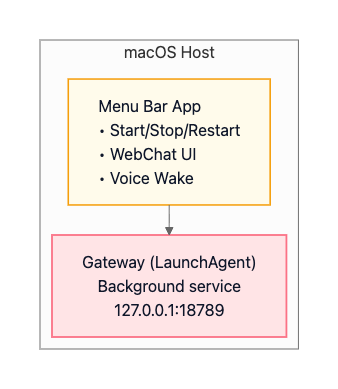

](https://substackcdn.com/image/fetch/$s_!R0Bu!,f_auto,q_auto:good,fl_progressive:steep/https%3A%2F%2Fsubstack-post-media.s3.amazonaws.com%2Fpublic%2Fimages%2F4b6e0a47-4882-4370-9690-b71a96f7c792_338x389.png)

This deployment enables native macOS integration, including iMessage support since iMessage requires running on an actual Mac. Voice Wake integrates with ElevenLabs for speech recognition and synthesis. Canvas support through the A2UI system provides a visual workspace for agent-driven interfaces.

Running OpenClaw on a VPS or virtual machine provides 24/7 availability without requiring your personal computer to stay on. The Gateway runs as a `systemd` service on the remote host and can remain bound to loopback (`127.0.0.1`) for security. Your local clients (CLI and Web UI) connect through an SSH tunnel that forwards a local port to the remote loopback port.

The SSH port-forward maps your local `127.0.0.1:18789` to the remote Gateway’s `127.0.0.1:18789`:

    ssh -N -L 18789:127.0.0.1:18789 user@vps

Once the tunnel is established, your local CLI and Web UI connect to `127.0.0.1:18789` on your machine, and traffic is transparently forwarded through the encrypted SSH tunnel to the remote Gateway:

[

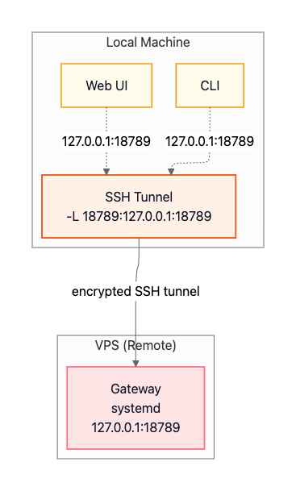

](https://substackcdn.com/image/fetch/$s_!gEaj!,f_auto,q_auto:good,fl_progressive:steep/https%3A%2F%2Fsubstack-post-media.s3.amazonaws.com%2Fpublic%2Fimages%2Ff6598bd3-6b15-4880-8688-4bf6dcc6227c_367x609.png)

Tailscale offers an alternative approach for VPS deployments. Instead of maintaining an SSH tunnel, you join both your VPS and your client devices to the same Tailscale network (a “tailnet”). The VPS uses Tailscale Serve to expose the Gateway via HTTPS to other devices on the tailnet (for example, `https://vps.tailnet.ts`). This provides encrypted access without managing SSH keys or tunnel processes.

[

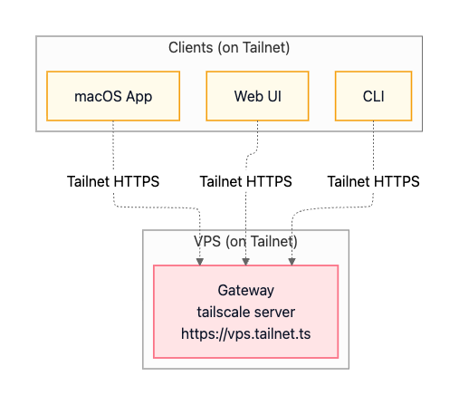

](https://substackcdn.com/image/fetch/$s_!CaLD!,f_auto,q_auto:good,fl_progressive:steep/https%3A%2F%2Fsubstack-post-media.s3.amazonaws.com%2Fpublic%2Fimages%2F33a4546b-a7b0-45df-8b0b-b8047e25deb2_507x447.png)

[Fly.io](http://fly.io/) is a cloud-native deployment option where the Gateway runs in a Docker container managed by [Fly.io](http://fly.io/). A persistent volume stores OpenClaw state (configuration, sessions, credentials) so it survives deploys and restarts. [Fly.io](http://fly.io/) provides a managed HTTPS endpoint (with TLS termination) in front of the container, making the Gateway reachable remotely over the public internet.

The architecture diagram:

[

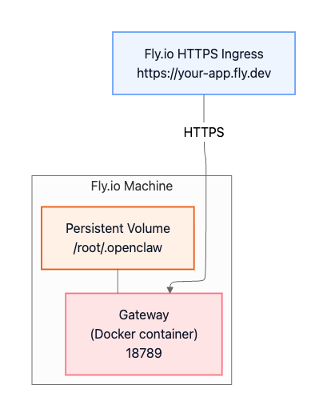

](https://substackcdn.com/image/fetch/$s_!8E9t!,f_auto,q_auto:good,fl_progressive:steep/https%3A%2F%2Fsubstack-post-media.s3.amazonaws.com%2Fpublic%2Fimages%2F8737fe17-2d55-48ae-b0fd-2a7a04e448f7_409x521.png)

Because the Gateway is reachable from the public internet in this pattern, you should enable strong authentication and treat it as an internet-facing service.

OpenClaw represents a modern approach to personal AI infrastructure: local-first, self-hosted, and fully controllable. Its architecture balances simplicity through the single-process Gateway model with power through multi-agent routing, tool sandboxing, and extensible plugins. This makes it accessible to developers just getting started while remaining production-ready for demanding use cases.

The hub-and-spoke design around the Gateway control plane enables unified access across messaging platforms. You get a consistent agent experience whether you’re messaging from WhatsApp, Discord, or iMessage. Strong security boundaries protect against untrusted inputs without sacrificing capability. The agent-native runtime with tool execution and persistent sessions delivers a truly intelligent assistant experience, not just a chat wrapper around an LLM.

Whether you run OpenClaw on your laptop for personal use or deploy it to a VPS for 24/7 availability, you get a private AI assistant accessible from anywhere. You retain control over where it runs, how it’s exposed, and how data is stored and accessed.

In an era where AI capabilities are increasingly locked behind proprietary APIs and walled gardens, OpenClaw offers an alternative: run the assistant on your terms, accessible through the channels you already use, with transparency into how it works.