# OpenClaw Deep Dive
## Under the Hood of the Agentic OS

How do you build a system that executes real-world tasks securely?

  Press Space to explore the implementation <carbon:arrow-right />

---
transition: slide-up
---

# Real-world Automation: Chat to Browser

<strong>No UI needed.</strong> Command OpenClaw natively via <strong>Feishu</strong> and watch it drive the browser autonomously.

  <!-- Left Column: The Phone -->
  

    

      

        <carbon:chat /> 1. Command via Feishu
      

      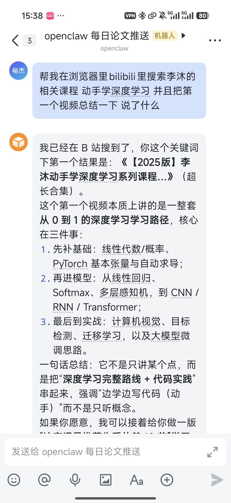
    

  

  <!-- Middle: Arrow -->
  

    

      <carbon:arrow-right />
    

  

  <!-- Right Column: Browser Execution -->
  

    

       

        <carbon:bot /> 2. Autonomous Action
      

      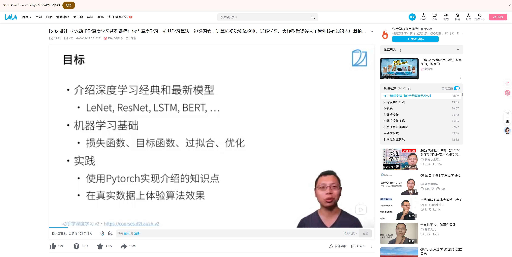
    

  

    
🌐

    

      
OpenClaw Browser Relay

      

        OpenClaw takes over the browser, searches for <em>"Mu Li - Deep Learning"</em> on Bilibili, summarizes the video content, and streams the structured result back to the user.
      

    

  

  

---
transition: fade-out
layout: image-right
image: ./docs/images/starthistory.svg
# 核心修正 1：强制内容靠顶并减小内边距
class: "pt-8 pb-4"
# 核心修正 2：调整背景图缩放并居中，防止被文字挤掉
backgroundSize: 85%
backgroundRepeat: no-repeat
backgroundPosition: "center right 5%"
---

# The OpenClaw Phenomenon

Before diving into the code, it's crucial to understand the context of the project.

- 👤 **Creator**: Created by Peter Steinberger (founder of PSPDFKit) as a weekend project named "Clawdbot".
- 📈 **Growth**: Evolved into "OpenClaw", surpassing 250,000 stars in weeks.
- 🤝 **Independence**: After Peter joined OpenAI in Feb 2026, OpenClaw transitioned to an independent foundation.

OpenClaw isn't just a chatbot wrapper—it's a <b>structured execution environment</b> acting as an Operating System for LLMs.

---
transition: slide-up
layout: two-cols
# 核心修正 1：强制顶部对齐
class: "pt-8"
---

# The Gateway implementation

The Gateway (`src/gateway/server.ts`) is the single source of truth for the entire system, built on **Node.js 22** using the `ws` WebSocket library.

- 🔒 Binds to `127.0.0.1:18789` loopback by default.
- 🚦 Uses an **event-driven RPC model**, strictly typed via TypeBox and JSON Schema validation.
- 🔑 Implements **Idempotency Keys** for UI network retries, preventing duplicate tool executions.

**Implementation Flow**

1. **Client sends an action** over WebSocket.
2. **Access Control Check**: Verifies `token` or Challenge.
3. **Dispatch**: Routes payloads to the `Agent Runtime`.

::right::

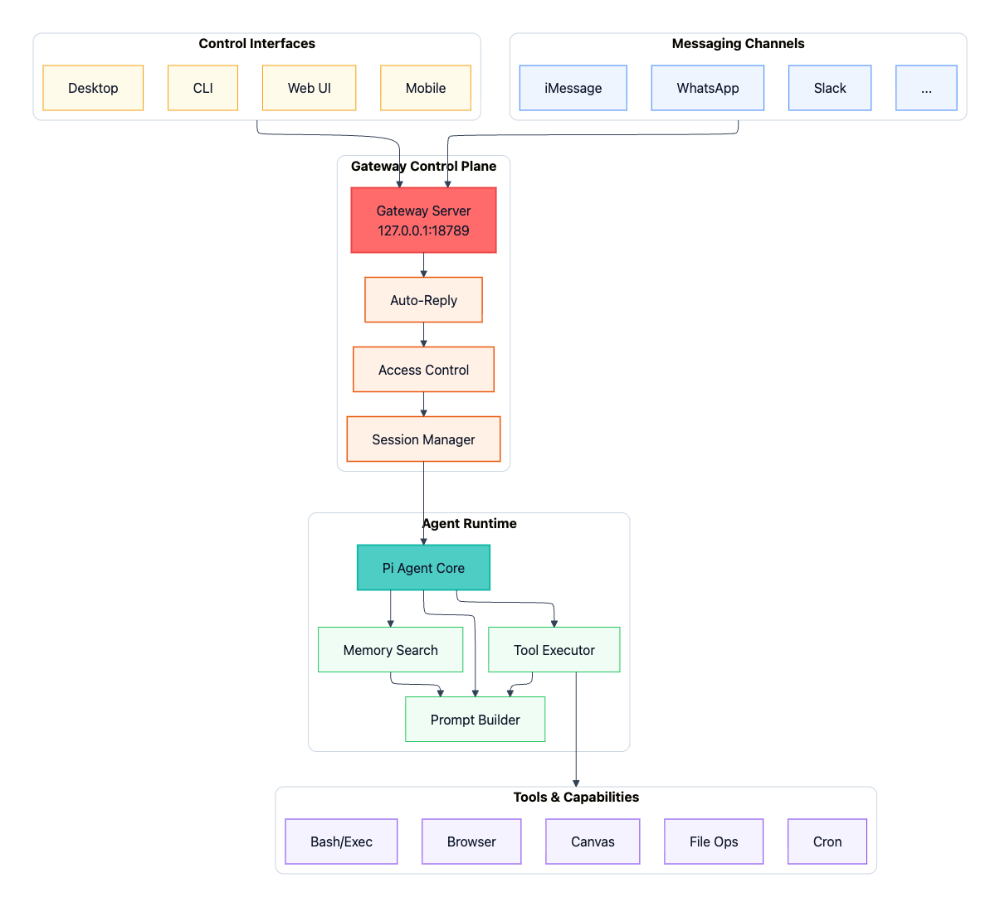

---
transition: slide-left
---

# Channel Adapters & Normalization

How does OpenClaw handle WhatsApp, Discord, and Telegram simultaneously?

**Underlying Libraries**

Each platform has a dedicated adapter that handles protocol quirks:
- **WhatsApp**: Uses the `Baileys` WebSocket protocol library.
- **Telegram**: Handled via `grammY`.
- **Discord**: Uses `discord.js`.

**Message Normalization**

Adapters intercept platform-specific formats and normalize them into standard OpenClaw Events:
- Extracts attachments & media.
- Translates Markdown dialects.
- Handles UI typing indicators natively.

**Access Control Pipeline** — Before an inbound message hits the agent, it must pass the policy check: `channels.whatsapp.allowFrom` arrays are verified. Unknown DMs trigger the `"pairing"` policy, returning a 6-digit confirmation code instead of hitting the LLM.

---
transition: slide-up
---

# The Agent Runtime (`PiEmbeddedRunner`)

The core engine where the intelligence loop executes, powered by <code>@mariozechner/pi-agent-core</code>.

<h3 class="text-blue-500 font-bold mb-1 text-sm">1. Session Resolution</h3>
Resolves incoming message to a strict identifier. 
e.g. <code>agent:main:whatsapp
:group:120...@g.us</code> 
This bounds the sandboxing rule.

<h3 class="text-green-500 font-bold mb-1 text-sm">2. Context Assembly</h3>
Loads <code>AGENTS.md</code>, injected SKILL subsets dynamically, and hits the <strong>Memory SQLite db</strong> for historical relevance.

<h3 class="text-orange-500 font-bold mb-1 text-sm">3. Stream & Tool Interception</h3>
LLM response is token-streamed. When a Tool Call is detected, it intercepts, evaluates, and streams the stdout result back into the generator loop.

  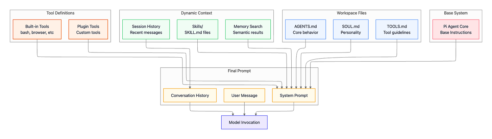

---
transition: slide-left
---

# Multi-Model Provider Support

OpenClaw is <strong>model-agnostic</strong> — swap your LLM without touching a single line of business logic.

  

    
    
OpenAI

    
GPT-5.4 / codex

  

  

    
    
Claude

    
4.6 Sonnet / Claude code

  

  

    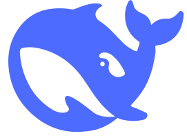
    
DeepSeek

    
V3 / R1

  

  

    
    
Gemini

    
3.1 Pro / Flash

  

  

    
    
Ollama

    
Local Models

  

  

    
🔌 Unified Adapter Layer

    All providers share a single typed interface. Switching from GPT-5 to Claude requires one config line change.
  

  

    
⛓️ Auto Failover Chain

    If a provider is rate-limited or unavailable, OpenClaw automatically cascades to the next configured provider.
  

  

    
🔑 BYO API Keys

    Credentials stored locally at <code>~/.openclaw/credentials/</code>. No vendor lock-in, no cloud dependency.
  

---
transition: slide-left
---

# 1. Native Provider Mode 

<strong>Native runtime: OpenClaw is the brain, and the model is just the backend.</strong>

  
OpenClaw governs the entire <strong>agent loop</strong>: context assembly, session management, hooking up native tools, and invoking the configured model provider.

  
If you use <code>openai-codex/...</code>, Codex acts strictly as a "model supplier / auth channel," not an external agent.

  

    
🛠️ About Tool Calls

    Session management, discovery, and tool wiring are <strong>owned by OpenClaw</strong>. Native tools are entirely intercepted and executed on the OpenClaw side.
  

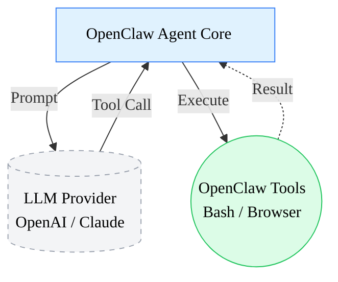

---
transition: slide-left
---

# 2. CLI Backend Mode

<strong>CLI Backend: OpenClaw invokes a command-line blackbox and fetches the result.</strong>

  
Treats terminal CLIs like <code>claude</code> or <code>codex</code> as a "text blackbox": assembles the prompt, spawns the CLI process, and reads the text / json / jsonl output.

  
Officially defined as a <strong>text-only fallback runtime</strong>. While it supports session continuation, it is fundamentally a <strong>text-in → text-out</strong> flow.

  

    
🚫 About Tool Calls

    <strong>Tools are disabled / no tool calls.</strong> OpenClaw does not intercept or execute tools locally; it simply "feeds input in, and reads output out."
  

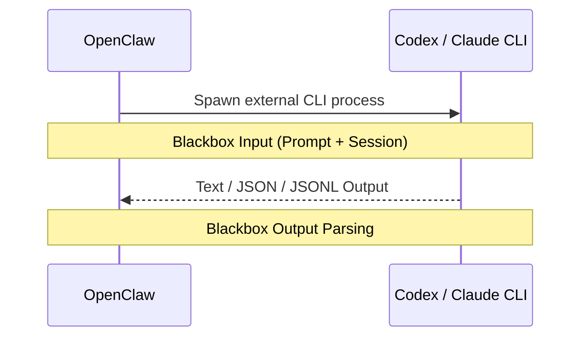

---
transition: slide-up
---

# 3. ACP Mode

  <strong>ACP Agent: OpenClaw connects to an external agent, letting it run continuously.</strong>

  
Instead of treating external CLIs as mere "blackbox output sources", OpenClaw integrates them as fully-fledged <strong>external agent runtimes</strong>.

  
<strong>ACP sessions</strong> are designed to connect external coding harnesses. They grant full lifecycle control: create/resume sessions, bind threads to ACP, and steer/cancel at any time.

  

    
🤝 About Tool Calls

    Core execution capabilities entirely reside with the <strong>external agent (Harness)</strong>. The external chain does the continuous work, while OpenClaw handles <strong>bridging, routing, and presentation</strong>.
  

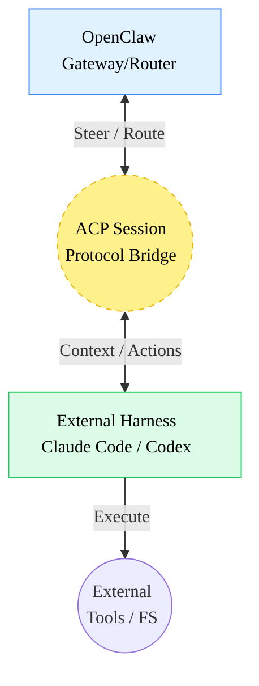

---
transition: slide-left
---

# 1. Memory as Source of Truth

<strong>Memory is purely editable Markdown files on disk, not an invisible model state.</strong>

  
<strong>Long-term Notebooks:</strong> OpenClaw writes durable facts and preferences into <code>MEMORY.md</code>, while process notes and daily context are dumped into <code>memory/YYYY-MM-DD.md</code>.

  
<strong>The Index Layer (SQLite):</strong> Plain files are hard to search. OpenClaw builds a lightweight local index using <strong>SQLite + sqlite-vec</strong> to enable hybrid search (BM25 + Vector Similarity).

  

    
💡 Core Philosophy

    The true memory resides in <strong>Markdown</strong> files. SQLite is merely a retrieval directory. You can manually read, audit, and edit the agent's memory at any time.
  

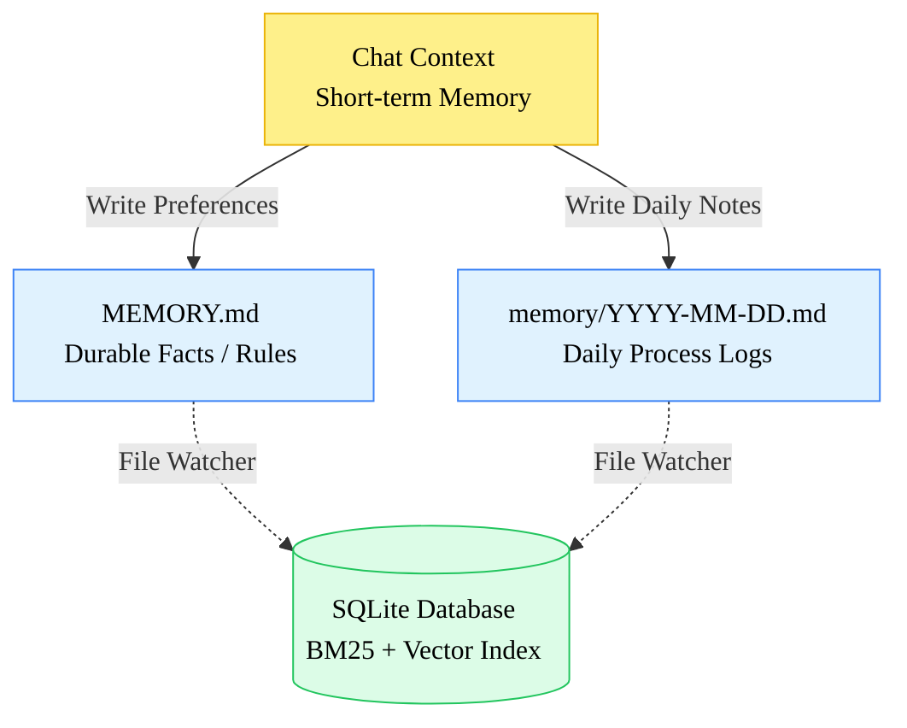

---
transition: fade-out
---

# 2. Retrieval & Compaction

<strong>Find what matters (Embeddings) & forget the chatter (Compaction).</strong>

  

    <strong>Embedding Failover:</strong> 
    Vector search requires embeddings. OpenClaw calculates them locally if a model exists; otherwise, it falls back to remote APIs.
  

  

    <strong>Pre-compaction Ping:</strong> 
    Approaching context limits triggers a secret <em>Memory Flush</em> agentic turn, demanding the model save important facts.
  

  

    
🗜️ Shrinking the Context

    After flushing valid facts, older turns are compacted to summaries, preventing explosion.
  

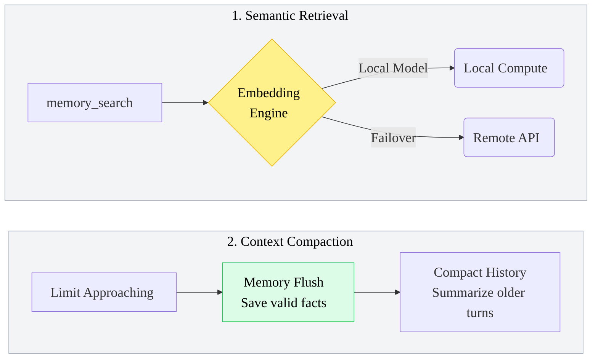

---
layout: center
class: text-center
---

# Sandboxing & Security Boundaries
How OpenClaw prevents a WhatsApp user from deleting your filesystem.

  <v-clicks>
    
  - 🛑 **Differential Sandboxing by Session**:
    - `agent:<id>:main` -> Executed natively on Host (Full Bash access).
    - `dm:*` and `group:*` -> Tool execution forced into **Ephemeral Docker Containers**.
  
  - 🛑 **Progressive Tool Policy Matrix**:
    `Profile -> Global -> Provider -> Agent -> Group -> Sandbox`.
    Group policy can restrict tool availability (e.g., disable `browser_control`), overriding global config.
    
  - 🛑 **Prompt Injection Defenses**:
    Sources are tagged. System instructions are strongly isolated from user payloads to prevent the model from parsing a malicious payload as a system instruction override.

  </v-clicks>

---
transition: slide-up
class: text-center
---

# Extensibility (Plugins)

OpenClaw is extended without touching <code>src/</code>.

  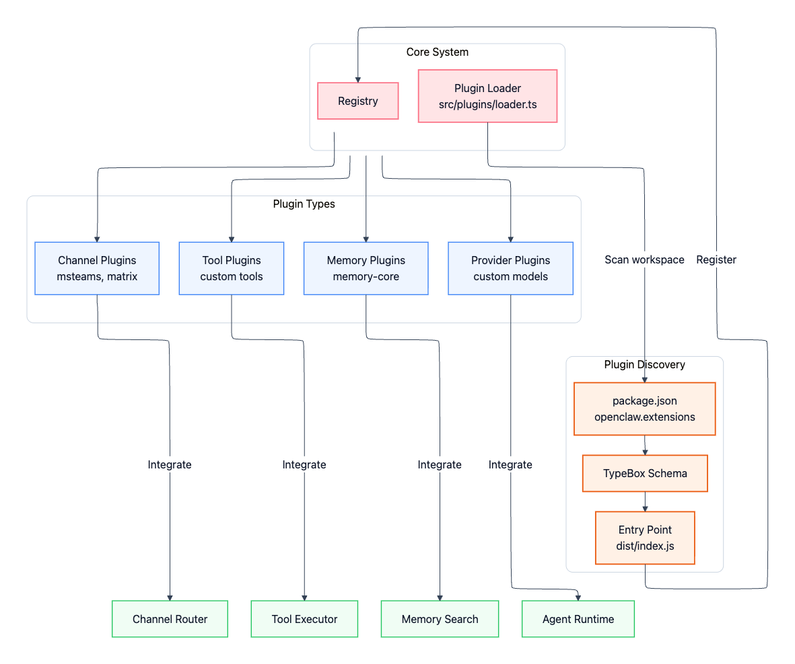

  The Plugin Loader scans <code>package.json</code> for <code>openclaw.extensions</code>. 
  Dynamically inject new model providers, custom UI widgets, or external API tools without rebooting the Gateway core.

---
transition: slide-up
---

# ClawHub — The Skills Marketplace

OpenClaw's <strong>npm for AI agents</strong> — publish, install, and compose skills on demand.

  

    
📦 100+ Skills

    Bash execution, Browser automation, File Ops, Cron jobs, Canvas rendering & more.
  

  

    
🔍 Vector Search

    Semantic search over the registry — find the right skill by describing what you need.
  

  

    
🔄 Versioned Packages

    Like npm — skills are published, versioned, and community-maintained by any developer.
  

  

    
⚡ Hot-loaded

    Skills inject at runtime — no Gateway restart required. Install and invoke instantly.
  

  

    ☠️
    The ClawHavoc Incident (Early 2026)
  

  

    
Attackers uploaded <strong>hundreds of malicious skills</strong> to ClawHub, mimicking legitimate tools with near-identical names.

    
Once installed, they silently <strong>exfiltrated API keys, session tokens, and local credential files</strong> to remote C2 servers.

    
The incident exposed the fundamental tension of open skill marketplaces: <em>openness vs. supply chain security</em>.

    

      ⚠️ Always verify publisher identity and audit permissions before installing any skill.
    

  

---
layout: center
class: text-center
---

# What's Next for OpenClaw

From personal agent to enterprise-grade distributed runtime.

  
📬

  
Native Task Queue

  
Persistent, prioritized task queue for long-running jobs. No more dropped tasks during LLM timeouts or connection drops.

  
🌐

  
Multi-Node Distributed

  
Horizontal scaling of Agent Runtimes across machines. One Gateway, many Executor nodes — true enterprise scale.

  
📋

  
SDD Paradigm

  
Shift from <em>prompt engineering</em> to <strong>Specification-Driven Development</strong> — agents guided by structured behavioral specs.

  "OpenClaw is not a chatbot. It's the first real Operating System for LLM agents." — Peter Steinberger

---
layout: center
class: text-center
---

# Thank You

  

    YuJieHuang
  

  

    <carbon:email class="text-xl opacity-80" />
    YuJieHuang0526@gmail.com
  

  
  

    
References & Further Reading

    <a href="https://ppaolo.substack.com/p/openclaw-system-architecture-overview" target="_blank" class="hover:text-teal-500 transition-colors flex items-center gap-1 justify-center">
      <carbon:link /> OpenClaw System Architecture Overview
    </a>
    <a href="https://github.com/openclaw/openclaw" target="_blank" class="hover:text-teal-500 transition-colors flex items-center gap-1 justify-center">
      <carbon:logo-github /> github.com/openclaw/openclaw
    </a>
  

